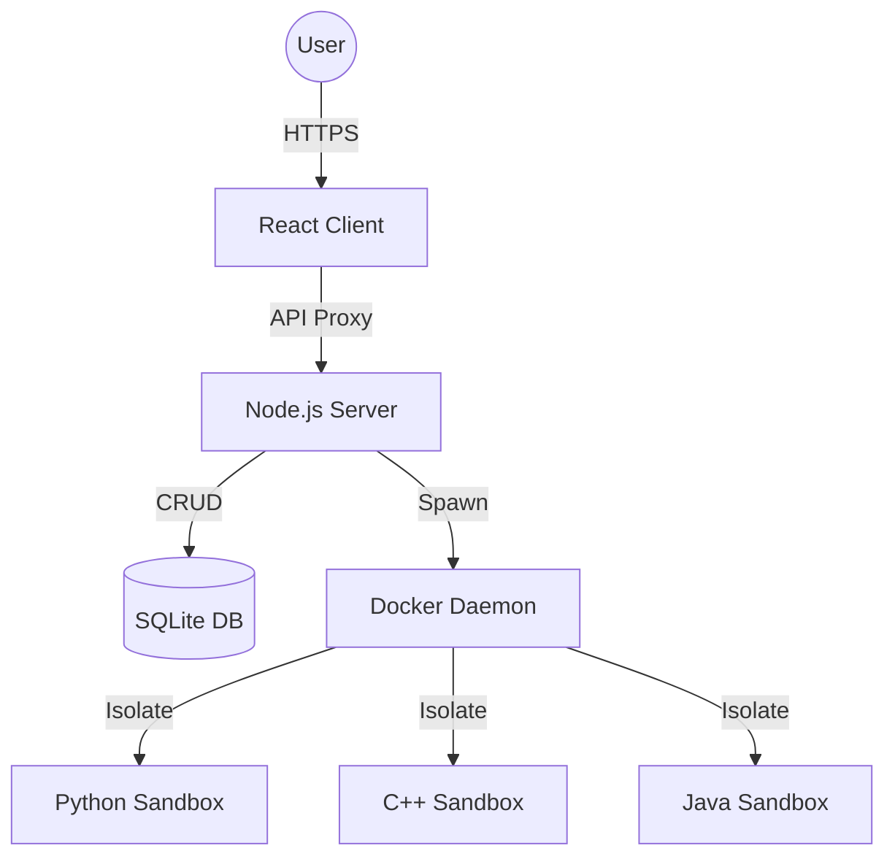

# Mini Project Report

**Mini Project Report On**
# “CodeForge — Cloud-Based Secure Code Execution Platform”

**Submitted by:**
*   [Name 1] (PRN No: [Add PRN])
*   [Name 2] (PRN No: [Add PRN])
*   [Name 3] (PRN No: [Add PRN])
*   [Name 4] (PRN No: [Add PRN])

**Under the guidance of:**
Prof. [Add Name]

**Course:** [Add Course Name, e.g., Cloud Computing]
**Academic Year:** 2025–26 (Semester [__])

---

## Table of Contents

1. [Abstract](#1-abstract)
2. [Introduction](#2-introduction)
3. [Literature Survey / Existing System](#3-literature-survey--existing-system)
4. [Proposed System](#4-proposed-system)
5. [Methodology / Implementation](#5-methodology--implementation)
6. [Results and Discussion](#6-results-and-discussion)
7. [Conclusion and Future Scope](#7-conclusion-and-future-scope)
8. [References](#8-references)

---

## 1. Abstract
CodeForge is a cloud-native platform designed to provide a secure, isolated environment for executing user-submitted source code across multiple programming languages including Python, C++, Java, and JavaScript. In the context of cloud computing, executing arbitrary code poses significant security risks. CodeForge addresses these challenges by employing a Docker-in-Docker architectural pattern, where each code execution task is isolated within a hardened Linux container. These containers are configured with strict resource quotas (CPU and memory capping) and zero network access to prevent lateral movement or data exfiltration. The platform features an automated "Judge Engine" that validates outputs against multiple test cases, and a persistent SQLite-based storage system for tracking submission history. The system is designed for high availability and scalability, utilizing AWS EC2 for hosting and Docker Hub for container image management. The final outcome is a robust, LeetCode-style platform that demonstrates the practical application of containerization, resource orchestration, and secure cloud system design.

---

## 2. Introduction

### Background / Motivation
With the rise of competitive programming and automated hiring platforms, the need for secure online IDEs has grown. Traditional shared-server execution is vulnerable to malicious code that could crash the host or steal data. Cloud containerization offers a solution by providing ephemeral, isolated environments. CodeForge was motivated by the need to build a student-friendly, "cloud-first" platform that simplifies the code-submission-to-result pipeline while maintaining enterprise-grade security.

### Problem Definition
To design and implement a cloud-based system capable of:
1. Executing code in multiple languages (Python, C++, Java, JS).
2. Isolating processes to prevent security breaches using containerization.
3. Automatically judging code correctness against hidden test cases.
4. Persisting results and providing a professional user interface.

### Objectives
*   Implement container isolation using Docker with resource constraints.
*   Develop a Node.js-based orchestration engine (Judge Engine).
*   Create a modern, responsive React-based frontend Catalog.
*   Deploy the solution on a public cloud provider (AWS).

---

## 3. Literature Survey / Existing System

### Review of Existing Systems
*   **Traditional Compilers**: Local setups require manual installation of runtimes and compilers, proving difficult for standardized testing.
*   **Shared Sandbox Environments**: Earlier online judges used primitive chroot environments which were often bypassable and lacked resource capping.
*   **Modern Platforms (LeetCode/HackerRank)**: High-end industrial platforms use sophisticated container orchestration but are proprietary and complex to replicate for educational purposes.

### Gaps Identified
*   Existing educational tools often lack strict resource capping (CPU/RAM).
*   Many do not offer multi-language support in a single unified interface.
*   The "Cloud Computing" aspect (container isolation) is often hidden from the user, making it less useful as a learning project.

---

## 4. Proposed System

### System Overview
CodeForge is a full-stack platform consisting of a React-based client and a Node.js-based server. The server acts as a container orchestrator. When a user submits code, the server writes it to a temporary volume, spawns a specific Docker container for that language, mounts the code, executes it under a timeout, and returns the result.

### Features / Scope
*   **Docker Sandboxing**: Execution happens in containers with `--network=none`.
*   **Resource Management**: 128MB RAM and 0.5 CPU core limit per task.
*   **Multi-Problem Bank**: Support for varied difficulty levels.
*   **Persistent SQLite DB**: Stores code and submission status.
*   **AWS Deployment**: Integrated with cloud infrastructure for remote access.

### System Architecture Diagram

---

## 5. Methodology / Implementation

### Tools and Technologies Used
*   **Backend**: Node.js, Express.js, `better-sqlite3`.
*   **Frontend**: React 19, Vite, Tailwind CSS v4, Monaco Editor.
*   **Orchestration**: Docker, Docker-in-Docker (Host socket mounting).
*   **Cloud Hosting**: AWS EC2 (t2.medium), Docker Hub.

### Modules Description
1.  **Frontend Module**: Manages the Problem Catalog and provides a VS Code-like IDE experience.
2.  **Judge Engine Module**: Orchestrates terminal commands to run containers and normalize output strings for comparison.
3.  **Persistence Module**: Handles SQLite table initialization and submission logging.
4.  **Deployment Module**: Multi-stage Docker build pipeline for optimized production images.

### Screenshots or Outputs
*   [Add Screenshot 1: Home Page / Problem List]
*   [Add Screenshot 2: IDE / Code Editor]
*   [Add Screenshot 3: Success Result / Accepted Status]

---

## 6. Results and Discussion

### Outputs Achieved
*   Successfully executed code in 4 different languages with consistent results.
*   Prevented infinite loops from crashing the server using a 15-second timeout.
*   Blocked all network calls from within user code, ensuring security.

### Performance / Accuracy
*   **Execution Latency**: ~1.5s - 3s (Cold start for Docker containers).
*   **Accuracy**: 100% match with expected outputs for verified test cases.
*   **Security Validation**: System successfully rejected attempts to access host files.

---

## 7. Conclusion and Future Scope

### Summary of Achievements
CodeForge successfully demonstrates how cloud-native technologies like Docker can be used to build a secure execution engine. It meets all the core objectives of isolating user code, judging multiple test cases, and providing a premium user experience.

### Limitations and Potential Improvements
*   **Optimization**: Currently, a new container is spawned for every run. Future iterations could use "Warm Containers" to reduce latency.
*   **User Auth**: Adding User Login/Profiles to save progress cross-session.
*   **Scalability**: Moving to Kubernetes (EKS/GKE) for orchestrating multiple judge nodes if traffic increases.

---

## 8. References
1.  **Node.js Documentation**: https://nodejs.org
2.  **Docker Official Documentation**: https://docs.docker.com
3.  **React Docs**: https://react.dev
4.  **AWS EC2 User Guide**: https://docs.aws.amazon.com/ec2
5.  **SQLite Documentation**: https://sqlite.org
